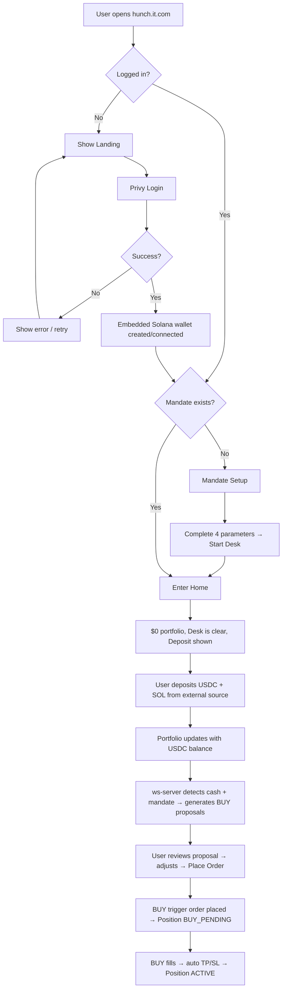
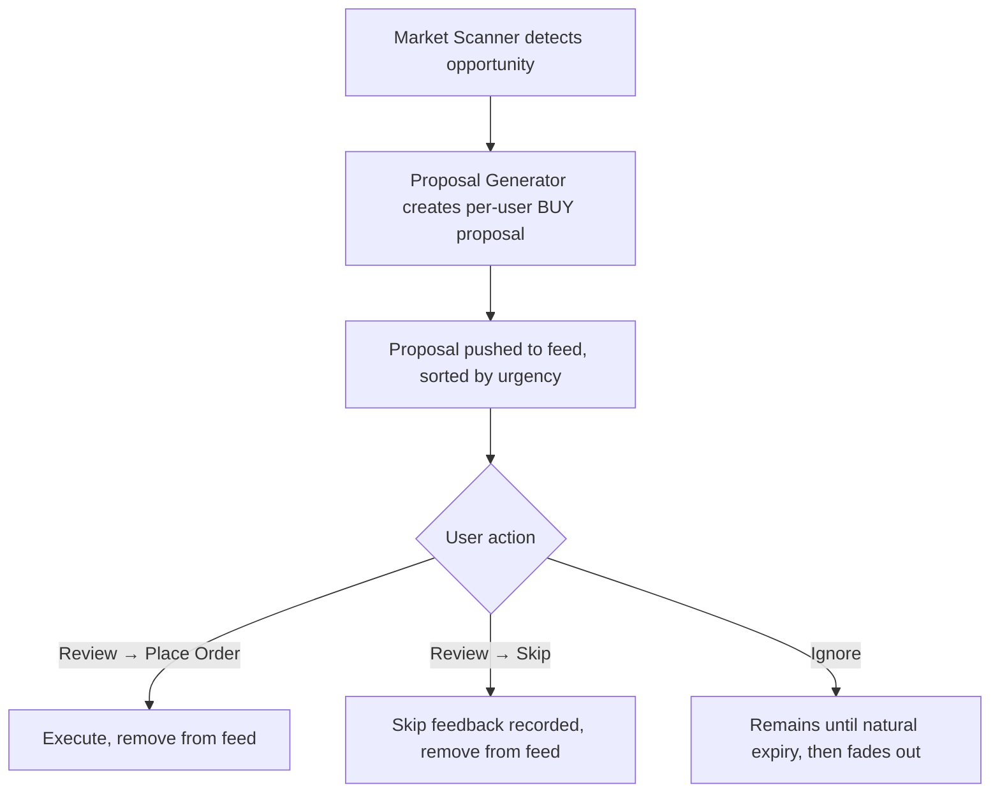
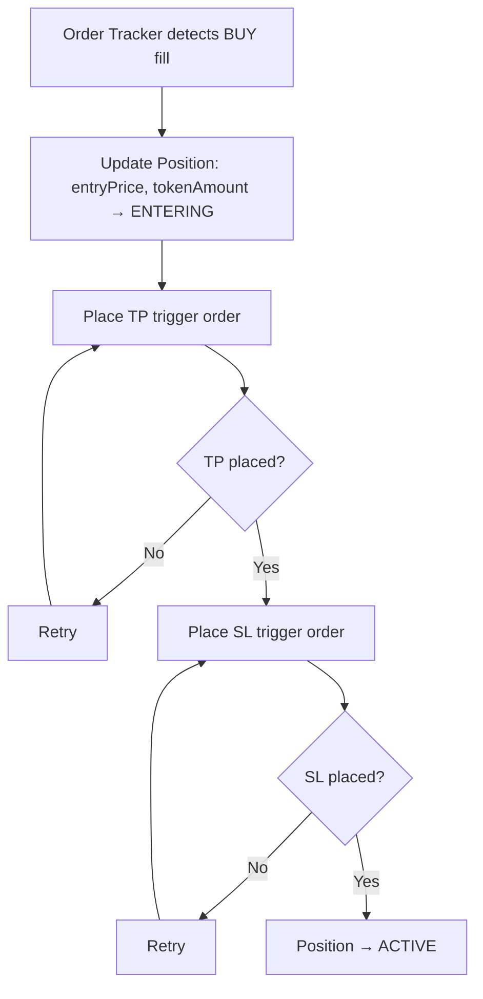
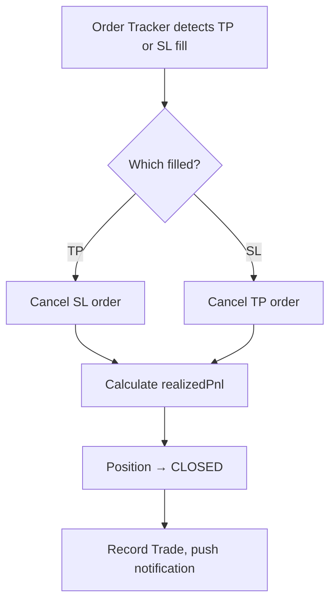
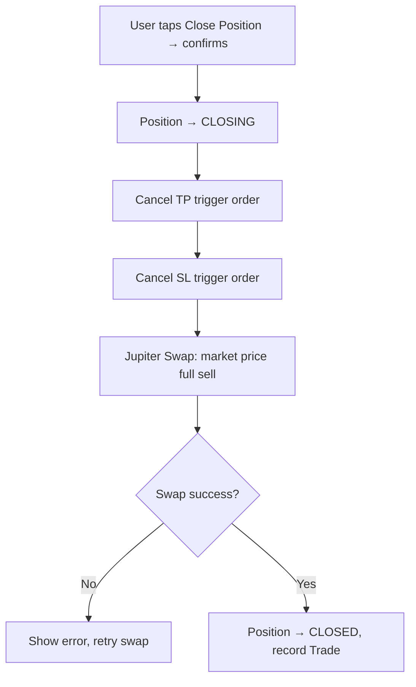
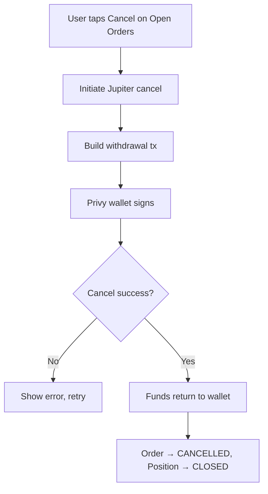
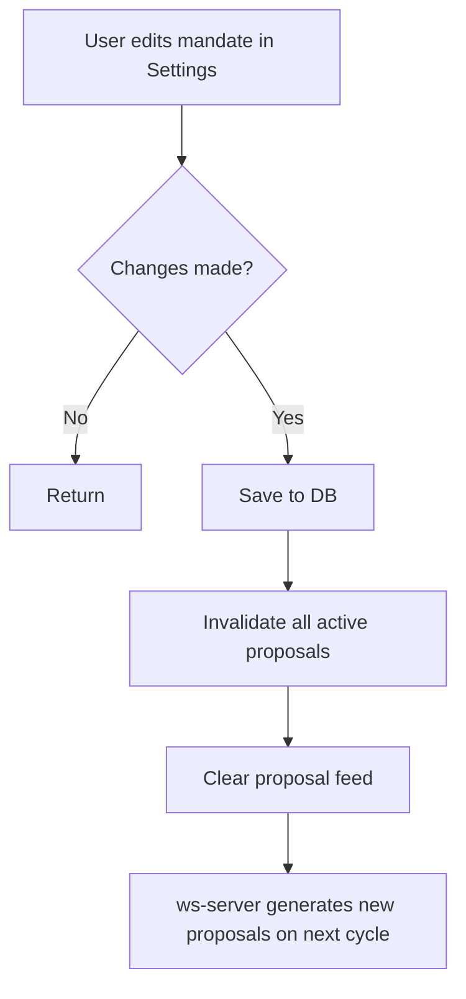

# Hunch — Screens & Flows

> Screen specifications, user flows, state machines, and error handling. This is the primary reference for frontend engineers and designers.
>
> **Read with**: product-overview.md (product context), api-contract.md (endpoint contracts + WebSocket events), data-model.md (schema + enums)
>
> Canonical supported asset metadata (sectors, tickers, liquidity tiers) lives in the Asset Registry (see data-model.md). Sector/ticker lists in this doc are display guidance only.

---

## Screen: Mandate Setup

The first screen after initial login. Collects four inputs that define how the system generates proposals for this user.

### Holding Period

| Option     | Label       |
| ---------- | ----------- |
| 1–3 days   | Short-term  |
| 1–2 weeks  | Swing       |
| 1–3 months | Medium-term |
| 6+ months  | Long-term   |

Affects: proposal expiry duration, TP/SL aggressiveness, which market events trigger proposals.

### Max Drawdown

| Option   |
| -------- |
| 3%       |
| 5%       |
| 8%       |
| No limit |

Affects the suggested SL price range.

### Max Trade Size

USD amount input field. The UI simultaneously displays what percentage this represents of the current portfolio.

### Market Focus

Multi-select. Users choose verticals (not individual tickers).

**Tokenized Stocks** verticals:

| Vertical              | Tickers                                                                            |
| --------------------- | ---------------------------------------------------------------------------------- |
| Technology / Software | AAPLx, MSFTx, GOOGLx, METAx, AMZNx, CRMx, ORCLx, PLTRx, AVGOx, CRCLx, ADBEx, SHOPx |
| Semiconductors        | NVDAx, TSMx, AMDx, INTCx, AMATx, SMHx, ASMLx, GEVx                                 |
| EV & Clean Energy     | TSLAx                                                                              |
| Financials / Fintech  | JPMx, GSx, HOODx, COINx, BACx, MAx, Vx, PYPLx, SQx                                 |
| Healthcare / Pharma   | LLYx, UNHx, ABTx, JNJx, MRKx, PFEx                                                 |
| Consumer / Retail     | MCDx, WMTx, NKEx, SBUXx                                                            |
| Energy / Utilities    | XLEx, XOPx, URAx                                                                   |
| Crypto Mining         | MSTRx, RIOTx, MARAx, CLSKx                                                         |
| Industrials           | CATx, DELLx, BAx                                                                   |

**Tokenized ETFs**: SPYx, QQQx, IWMx, VTIx, IEMGx, VGKx, SMHx, URAx, SGOVx, XLEx

**Bluechip Crypto**: SOL, BTC, ETH

Selecting "No preference" means all assets can generate proposals.

### CTA

**"Start Desk"** → Save mandate to PostgreSQL → navigate to Home.

The mandate can be edited later from the Settings page. Editing the mandate invalidates all active proposals and triggers regeneration.

**Note on enum values**: The UI displays human-readable labels ("1-3 days"), but stores canonical enum values (`SHORT_TERM`). See data-model.md for the `HoldingPeriod` enum and `MarketFocusOption` type.

---

## Screen: Home

Two main sections: **Portfolio Monitor** and **Proposals Feed**. Plus **Open Orders** and **Deposit UI**.

### Portfolio Monitor

**Summary bar:**

| Field       | Format                  |
| ----------- | ----------------------- |
| Total Value | $XX,XXX.XX (USDC)       |
| Day P&L     | +$XXX (+X.X%) green/red |
| Total P&L   | +$XXX (+X.X%) green/red |
| Cash (USDC) | $X,XXX.XX               |

**Holdings list** (sorted by portfolio weight, descending):

Each row:

| Field          | Example                         |
| -------------- | ------------------------------- |
| Ticker + Name  | NVDAx · NVIDIA                  |
| State          | Active / Buy Pending / Entering |
| Weight         | 34.2%                           |
| Value          | $5,130                          |
| Entry Price    | $142.31                         |
| Unrealized P&L | +$330 (+6.9%)                   |
| Day Change     | +1.2%                           |

Multiple positions in the same asset are listed separately, each showing its own state and P&L.

**Same-asset BUY proposals**: When a user already has active positions in an asset and receives a new BUY proposal for that asset, the new BUY creates a new independent Position (never averages into an existing one). The Position Impact section uses aggregate exposure across all positions in that asset/sector for the "before" state.

**Tap a holding row → opens Position Detail.**

### Proposals Feed

Cards sorted by expiry (most urgent first). BUY proposals only.

Each card:

| Element        | Example                                 |
| -------------- | --------------------------------------- |
| Action badge   | `BUY` (green)                           |
| Ticker + Name  | TSMx · Taiwan Semiconductor             |
| Suggested Size | $400                                    |
| TP / SL        | TP $195 / SL $168                       |
| Expires in     | 2h 15m                                  |
| Rationale      | One sentence, quantitative and specific |

**Rationale must be quantitative and specific:**

> "TSMx -4.2% on sector rotation. 12% below 20-day avg. Portfolio has 0% semis vs mandate."

Card CTA: **Review** → opens Proposal Detail.

**Empty state (has USDC)**: Suggested copy: "Desk is clear."
**Empty state (no USDC)**: Suggested copy: "Add USDC to receive new BUY proposals." Show Deposit section prominently.

### Open Orders

Full list of all unfilled trigger orders:

| Field         | Example                                      |
| ------------- | -------------------------------------------- |
| Asset         | NVDAx                                        |
| Kind          | BUY / TP / SL                                |
| Size          | $400                                         |
| Trigger Price | $174.50                                      |
| Status        | Open                                         |
| Actions       | Cancel (BUY pending only), Edit (TP/SL only) |

**Order UI statuses**: Preparing → Open → Filled / Expired / Cancelled / Failed. See api-contract.md for the full Order state transition table.

### Deposit

Prominently displayed when the user's wallet balance is zero. Accessible via a small icon otherwise.

- Privy wallet address (full, copyable)
- Copy button
- Instructions: "Send USDC and a small amount of SOL (for gas) to this address from any Solana wallet or exchange."

---

## Screen: Proposal Detail

Opened by tapping "Review" on a proposal card.

### Screen States

| State     | UI                                                                                                    |
| --------- | ----------------------------------------------------------------------------------------------------- |
| Loading   | Skeleton/loading indicator                                                                            |
| Not found | Error page with back-to-Home link                                                                     |
| Expired   | Read-only view of proposal data. "Place Order" disabled. Suggested copy: "This proposal has expired." |
| Active    | Full interactive action area (described below)                                                        |

### Header

| Element          | Example                     |
| ---------------- | --------------------------- |
| Action           | `BUY`                       |
| Ticker + Name    | TSMx · Taiwan Semiconductor |
| Expiry countdown | Expires in 2h 15m           |

### Price Chart

Pyth Benchmarks + Lightweight Charts. Time ranges: 1D | 5D | 1M | 3M.

**Chart annotations:**

- Suggested trigger price (horizontal line)
- Suggested TP price (green horizontal line)
- Suggested SL price (red horizontal line)
- User entry price, if already holding this asset (gray horizontal line). When the user has multiple active positions in the same asset, show the weighted average entry price.

### Reasoning

Three sections, each concise and specific.

**What Changed**
The market event or data point that triggered this proposal.

**Why This Trade**
The argument connecting the event to the buy thesis.

**Why It Fits Your Mandate**
Explicit mapping to mandate parameters:

- "Fits your 1–2 week holding period"
- "Position size $400 is within your $500 max trade size"
- "Adds semiconductor exposure, which your mandate targets"

### Position Impact

Static before/after comparison:

| Metric          | Before | After |
| --------------- | ------ | ----- |
| [Ticker] weight | 0%     | 18%   |
| Cash (USDC)     | $1,200 | $800  |
| Semis exposure  | 34%    | 52%   |

### Action Area

**Editable fields** (system provides defaults, user can adjust):

| Field         | Default                  | Notes                                                                   |
| ------------- | ------------------------ | ----------------------------------------------------------------------- |
| Size          | System-suggested amount  | USDC. Warning shown if exceeding mandate maxTradeSize, but not blocked. |
| Trigger Price | AI-suggested entry price | USD price trigger                                                       |
| TP Price      | AI-suggested TP price    | Auto-placed as trigger order after BUY fills                            |
| SL Price      | AI-suggested SL price    | Auto-placed as trigger order after BUY fills                            |

Slippage uses a safe default value, not exposed to the user.

**Buttons:**

| Button          | Behavior                                                                                      |
| --------------- | --------------------------------------------------------------------------------------------- |
| **Place Order** | Place BUY trigger order → Create Position (BUY_PENDING) → After BUY fills, auto-place TP + SL |
| **Skip**        | Expand skip feedback → remove proposal                                                        |

### Skip Feedback

Inline expansion. **"Why are you skipping?"**

| Option                      |
| --------------------------- |
| Too risky                   |
| Don't agree with the thesis |
| Timing doesn't look good    |
| Already enough exposure     |
| Price not attractive        |
| Too many proposals          |
| Other (free text)           |

---

## Screen: Position Detail

Opened by tapping a holding row on Home. Each independent position has its own Position Detail.

### Price Chart

Pyth Benchmarks + Lightweight Charts. Same time ranges as Proposal Detail.

**Chart annotations:**

- Entry price (gray horizontal line)
- Current TP price (green horizontal line)
- Current SL price (red horizontal line)

### Position Info

| Field            | Example         |
| ---------------- | --------------- |
| Ticker + Name    | NVDAx · NVIDIA  |
| State            | Active          |
| Quantity         | 5.62 shares     |
| Entry Price      | $142.31         |
| Current Price    | $150.00         |
| Value            | $843.00         |
| Unrealized P&L   | +$43.25 (+5.4%) |
| Days Held        | 4 days          |
| Portfolio Weight | 34.2%           |
| Take Profit      | $165.00         |
| Stop Loss        | $135.00         |

### Stock Intro

Short static company/asset description, hardcoded in the asset registry. One paragraph.

> "NVIDIA designs GPUs and AI accelerators. Dominant in data center AI training chips with ~80% market share. Trades on NASDAQ as NVDA; NVDAx is the tokenized version on Solana."

### Adjust TP/SL

Inline form (no page navigation). Only available when `state = ACTIVE`.

- **TP Price**: current value, editable → modifies the live TP trigger order via Jupiter in-place edit API
- **SL Price**: current value, editable → modifies the live SL trigger order
- **Update** button → submit changes

### Close Position

Bottom button. Only available when `state = ACTIVE`.

**"Close Position"** → Confirmation dialog: "Cancel all exit orders and sell your full position at market price?" → On confirm:

1. Cancel TP + SL trigger orders
2. Jupiter Swap API market price full sell
3. Position state → CLOSING → CLOSED

---

## Screen: Settings

Standalone page.

- Connected account info
- Wallet address (copyable)
- Current mandate summary + edit functionality
- Edit mandate → all active proposals invalidated → regeneration triggered
- Log out

---

## Core Flows

### Flow: New User



### Flow: Returning User

```
1. Open hunch.it.com (Privy session valid)
2. Home: holdings + P&L + proposals feed
3. Review proposal → Place Order or Skip
4. Or: tap into Position Detail → adjust TP/SL or Close Position
```

### Flow: Proposal Lifecycle



### Flow: BUY Fill → Auto TP/SL



### Flow: TP/SL Fill (OCO)



### Flow: User Close Position



### Flow: Cancel BUY Pending



### Flow: Mandate Change



### Flow: Adjust TP/SL

```
1. User modifies TP or SL price on Position Detail
2. Call Jupiter in-place edit API to update the trigger order
3. Update Position's currentTpPrice / currentSlPrice
4. Update Order record
5. Chart annotations move to reflect new values
```

---

## Position State Machine

```
BUY_PENDING  →  ENTERING  →  ACTIVE  →  CLOSING  →  CLOSED
     │                                                   ↑
     └───────────────────── (cancel) ────────────────────┘
                                        ACTIVE → CLOSED (TP/SL fill)
```

| State       | Meaning                                      | Available Actions            |
| ----------- | -------------------------------------------- | ---------------------------- |
| BUY_PENDING | BUY trigger order placed, waiting for fill   | Cancel order                 |
| ENTERING    | BUY filled, TP/SL being placed automatically | None (wait)                  |
| ACTIVE      | TP + SL both live, strategy running          | Adjust TP/SL, Close Position |
| CLOSING     | User-initiated close in progress             | None (wait)                  |
| CLOSED      | Position fully exited                        | View history                 |

---

## Error States

| Scenario                                    | User Sees                                                                                                                                                  |
| ------------------------------------------- | ---------------------------------------------------------------------------------------------------------------------------------------------------------- |
| Wallet has no SOL                           | "You need SOL for transaction fees."                                                                                                                       |
| Insufficient USDC                           | "Not enough USDC. You have $X available."                                                                                                                  |
| User rejects wallet signature               | "Transaction was not signed. No order was placed." No funds moved, no DB records created.                                                                  |
| Deposit confirmed but order creation failed | "Deposit confirmed but order creation failed. Your funds are in the Jupiter vault." Offer: retry order creation, or withdraw funds.                        |
| Trigger order creation failed               | "Order failed. Please try again." + retry                                                                                                                  |
| Trigger order expired unfilled              | Open Orders shows "Expired", prompt to reclaim vault funds via withdraw flow                                                                               |
| ws-server unreachable                       | "Unable to load proposals. Pull to refresh." Portfolio still works.                                                                                        |
| PostgreSQL unreachable                      | Fallback to client-side TanStack Query cached data from the current/recent session. Banner: "Some data may be outdated." No server-side cache layer in v1. |
| Privy session expired                       | Redirect to login (Privy handles this)                                                                                                                     |
| Zero portfolio + zero USDC                  | Deposit prominently shown. Suggested copy: "Desk is clear."                                                                                                |
| Pyth API unreachable                        | "Price chart unavailable." Trade execution still works.                                                                                                    |
| TP/SL auto-placement failed                 | Position stays in ENTERING, retries. User sees: Suggested copy: "Setting up exit orders..."                                                                |
| Close Position: cancel fails                | Do NOT proceed to swap. Retry cancellation. Position stays CLOSING.                                                                                        |
| Close Position: cancel succeeds, swap fails | Position stays CLOSING with no exit orders. Prompt user to retry swap.                                                                                     |

---

## Portfolio Readiness States

The Home screen adapts based on the user's portfolio state:

| State                       | UI Behavior                                                                                         | Proposal Eligibility      |
| --------------------------- | --------------------------------------------------------------------------------------------------- | ------------------------- |
| No USDC, no holdings        | Deposit section prominent. Suggested copy: "Desk is clear."                                         | No                        |
| USDC available, no holdings | Cash shown, ready for proposals                                                                     | Yes                       |
| Holdings, no USDC           | Show portfolio and Position Detail actions. Proposal feed: "Add USDC to receive new BUY proposals." | No (no funds for new BUY) |
| Holdings + USDC             | Full portfolio display + proposals feed                                                             | Yes                       |

---

## Cross-Screen System States

These states can appear on multiple screens and need consistent handling:

| State                      | Handling                                                                               |
| -------------------------- | -------------------------------------------------------------------------------------- |
| Not logged in              | Require login                                                                          |
| Session expired            | Privy handles re-authentication                                                        |
| No wallet                  | Create or connect wallet                                                               |
| API loading                | Show loading indicator                                                                 |
| API error                  | Generic error + retry                                                                  |
| Portfolio sync in progress | Show non-blocking sync indicator. Disable stale portfolio-dependent actions if needed. |
| No USDC                    | Prompt to deposit USDC                                                                 |
| No SOL                     | Prompt to deposit SOL                                                                  |
| ws-server disconnected     | Banner notification, portfolio still functional                                        |
| Price data unavailable     | "Price chart unavailable", trading still works                                         |
